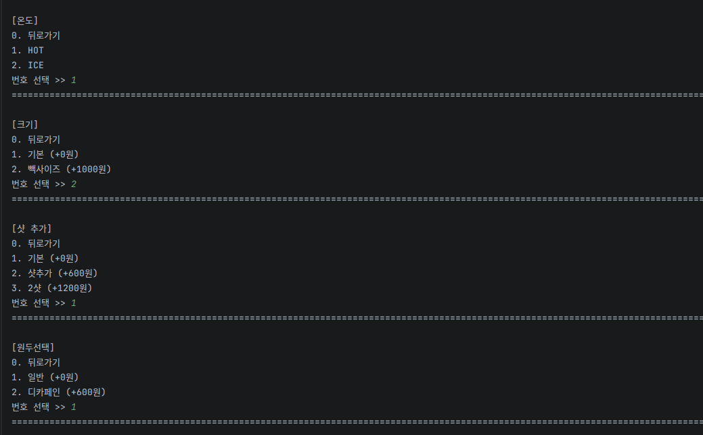
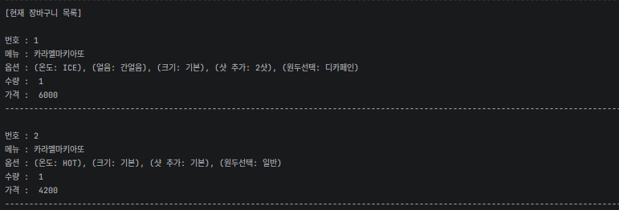

# ☕ 빽다방 키오스크 시스템 구현 (Python)

> **팀 프로젝트 (3조):** 파이썬을 활용한 키오스크 핵심 로직 구현 및 데이터 구조화
> **개발 기간:** 2026.04.20 ~ 2026.04.28

---

# ☕ 빽다방 키오스크 시스템 구현

## 1. 프로젝트 개요
> 프로젝트 목적 설명...
> 
> **

  

**

## 2. 요구사항 분석 및 설계
> 개발 전 기획 단계에서 작성한 문서들입니다.
>
> ### 📋 요구사항 분석서
> **

  
  

**
>
> ### 🔄 프로세스 순서도(Flowchart)
> **

  

**

## 3. 주요 기능 및 코드 로직
> 구체적인 구현 함수 및 데이터 구조 설명...

## 4. 실행 화면
> **[여기에 실행 스크린샷 배치]**

## 2. 주요 구현 기능
* **옵션 및 카테고리 시스템:** 메뉴의 효율적인 상세 옵션(온도, 크기 등) 선택 로직.
* **데이터 관리:** 장바구니 내 품목별 수량 추가, 삭제 및 실시간 데이터 갱신.
* **최종 출력:** 영수증 양식을 준수하여 품목명, 단가, 수량, 총액을 정렬하여 출력.

## 3. 담당 역할 및 코드, 로직 설계

* **카테고리 구조화:** 대규모 옵션 데이터를 효과적으로 관리하기 위한 카테고리 분류 및 참조 로직 개발.
* **데이터 타입 활용:** 리스트와 딕셔너리를 중첩하여 메뉴명, 가격, 수량을 매칭하고 동적으로 관리.
* **수량 제어 로직:** 장바구니 시스템 내 메뉴 갯수 변경 기능을 구현하여 실시간 금액 정산 연동.
* **영수증 출력 최적화:** 문자열 포맷팅을 활용해 영수증의 이름, 가격, 갯수 정렬 및 최종 인터페이스 구현.
* **캐스팅(Casting):** 입력받은 문자열 데이터를 정수형으로 변환하여 금액 산출 로직에 적용.

---

## 4. 실행 화면

### 1️⃣ 메뉴 카테고리 & 옵션 선택

  
  

### 2️⃣ 장바구니 시스템
선택한 메뉴를 리스트에 담고 수량을 변경하거나 삭제하는 동적 처리 과정입니다.

  
  

### 3️⃣ 최종 결제 및 영수증 출력
출력 시 글자 길이에 맞춰 정렬을 맞추고, 최종 금액을 산출하여 영수증을 출력합니다.

  

---

## 📝 코드 상세 보기 (Link)
* [옵션 선택 로직 코드](./RunScreen/옵션선택코드.png)
* [수량 변경 로직 코드](./RunScreen/수량변경코드.png)
* [영수증 가격 출력 코드](./RunScreen/영수증가격출력코드.png)

---

## 5. 프로젝트 회고 (느낀 점 및 어려웠던 점)

### 🔴 어려웠던 점 및 해결 과정
* **데이터 동기화 및 정밀 연산:** 장바구니 내 메뉴 갯수를 변경할 때마다 전체 합계 금액이 실시간으로 일치해야 하는 로직 구현이 가장 까다로웠습니다. 리스트 데이터를 인덱스 단위로 추적하여, 수량이 0이 될 때 리스트에서 삭제함과 동시에 금액 리스트도 동기화시켜 오차 없는 정산 시스템을 완성했습니다.
* **영수증 출력의 시각화:** 한글 품목명과 숫자 데이터의 바이트 차이로 인해 줄이 맞지 않는 문제가 있었습니다. 파이썬의 문자열 포맷팅 기능을 심층적으로 학습하여 데이터 타입별 공백을 계산했고, 실제 영수증과 유사한 가독성 높은 인터페이스를 구현했습니다.

### 🟢 느낀 점 및 배운 점
* **협업의 핵심은 '활발한 소통':** 설계부터 마무리 단계까지 팀원들과의 끊임없는 소통이 프로젝트의 성패를 결정한다는 것을 깨달았습니다. 서로의 문제점을 조기에 발견하고 도움을 주고받는 과정을 통해 개발 과정의 병목 현상을 해결할 수 있었습니다.
* **코드 리뷰를 통한 시야 확장:** 팀원들의 코드를 분석하며 동일한 기능을 구현하더라도 다양한 접근 방식이 존재함을 배웠습니다. 타인의 코드를 이해하고 내 것으로 만드는 과정이 기술적 성장에 큰 도움이 되었습니다.
* **로직 설계 역량의 강화:** 입력값 검증과 복잡한 데이터 처리 프로세스를 직접 해결해 나가며, 효율적인 알고리즘 설계와 예외 처리의 중요성을 깊이 체감했습니다.
