# ☕ 빽다방 키오스크 시스템 구현 (Python)

> **프로젝트 :** 팀 프로젝트 (5인)
> **개발 기간:** 2026.04.20 ~ 2026.04.28
> **핵심 과제:** 파이썬을 활용한 키오스크 핵심 로직 구현 및 데이터 구조화
---

## 1. 프로젝트 개요
실제 빽다방 키오스크의 사용자 경험을 분석하여, 주문부터 결제까지의 전 과정을 Python으로 구현한 프로젝트입니다. 데이터 흐름 설계와 예외 상황 처리에 집중하여 팀원 간의 코드 통합을 완성했습니다.

### 🛠 Tech Stack

#### 💻 Language

#### 🛠 IDE & Environment

  
  

일정표

> **일정표

  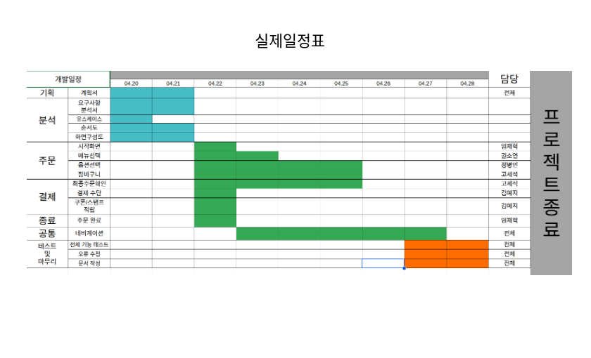

**
## 2. 요구사항 분석 및 설계

### 📅 프로젝트 일정표

  

### 📋 요구사항 분석서
| 요구사항 분석 (1) | 요구사항 분석 (2) |
| :---: | :---: |
| 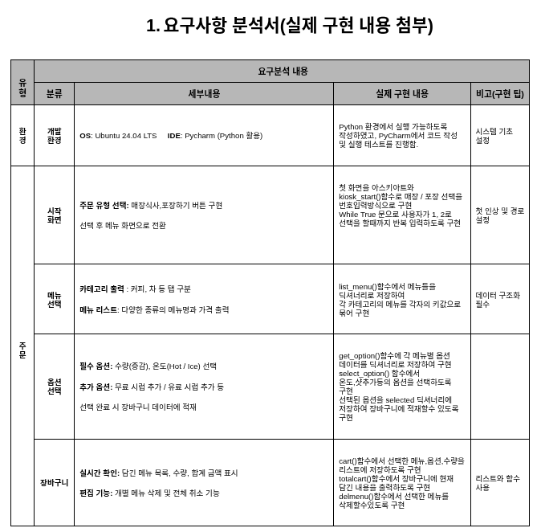 | 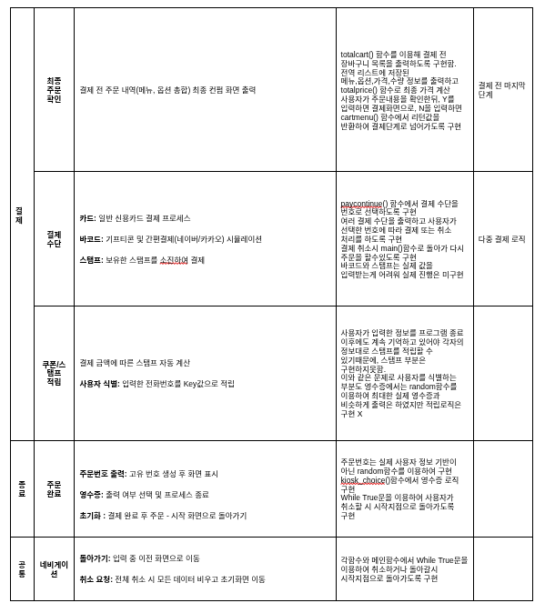 |

### 🔄 프로세스 순서도(Flowchart)

  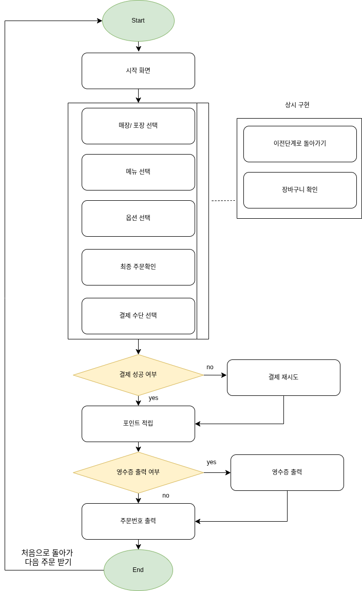

## 3. 담당 역할 및 핵심 로직

* **카테고리 구조화:** 대규모 옵션 데이터를 효과적으로 관리하기 위한 카테고리 분류 및 참조 로직 개발
* **데이터 타입 활용:** 리스트와 딕셔너리를 중첩하여 메뉴명, 가격, 수량을 매칭하고 동적으로 관리
* **수량 제어 로직:** 장바구니 시스템 내 메뉴 갯수 변경 기능을 구현하여 실시간 금액 정산 연동
* **영수증 출력 최적화:** 문자열 포맷팅을 활용해 영수증의 이름, 가격, 갯수 정렬 및 최종 인터페이스 구현
* **캐스팅(Casting):** 입력받은 문자열 데이터를 정수형으로 변환하여 금액 산출 로직에 적용

## 4. 실행 화면
> **

  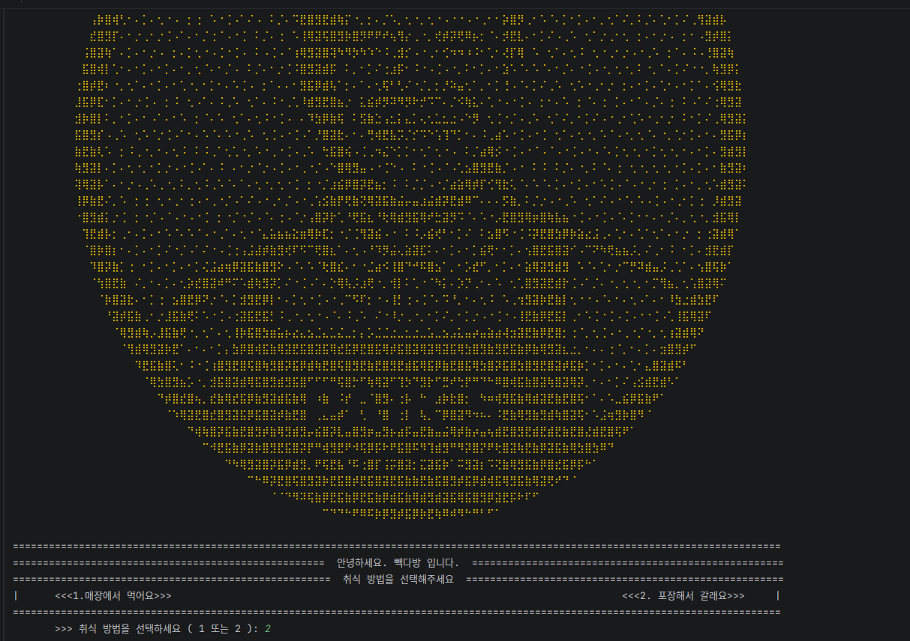
  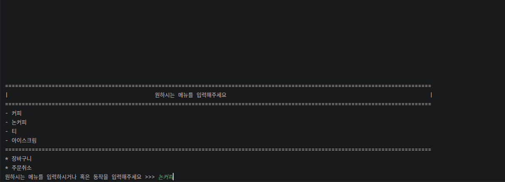
  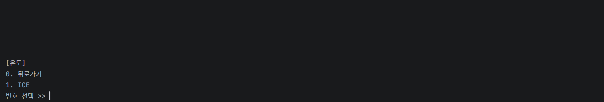
  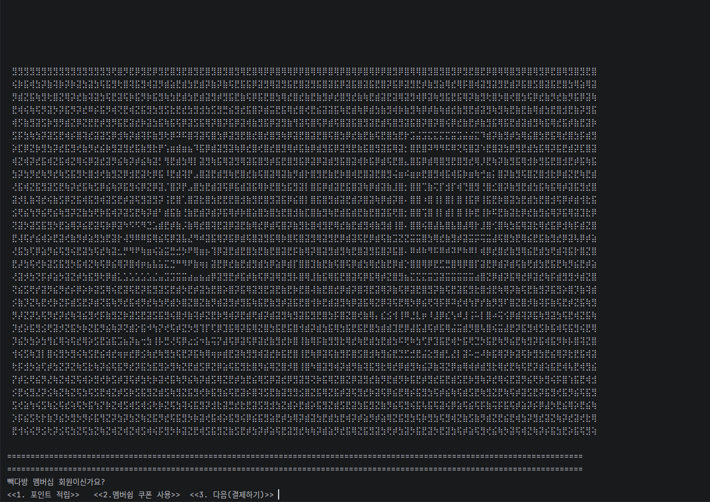
  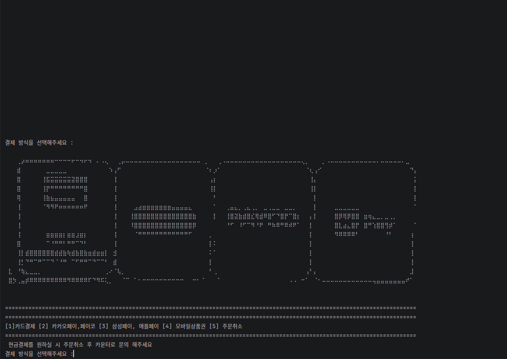
  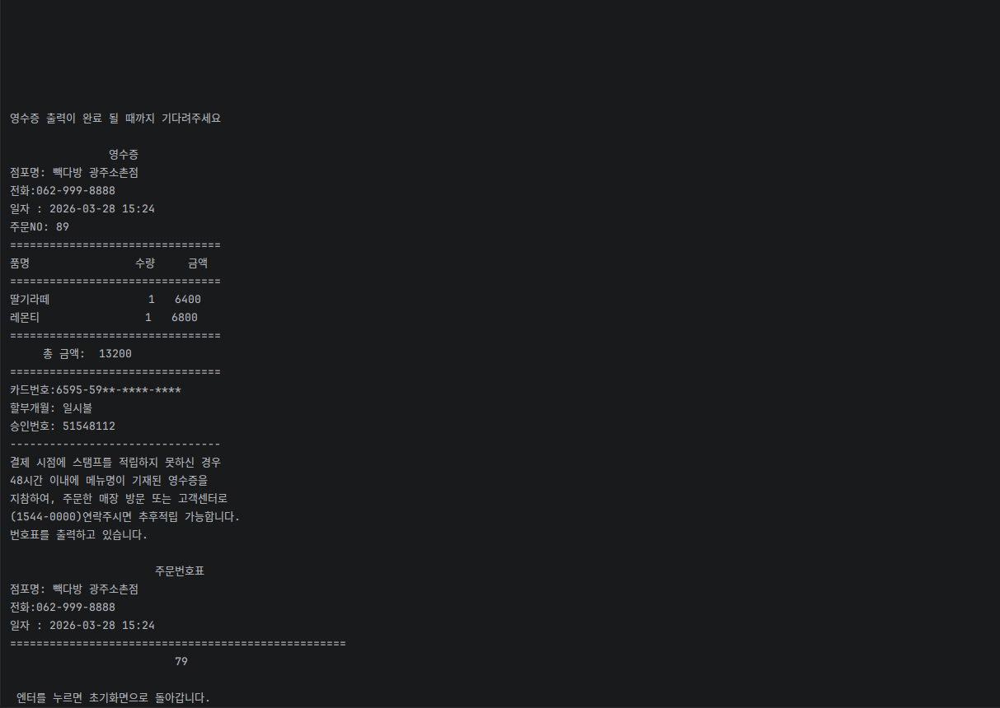

**

---

## 4. 실행 화면 및 시연

### 📺 전체 시연 영상 (2분 18초)

> **위 이미지를 클릭하면 최신 YouTube 시연 영상으로 이동합니다.**

### 📸 주요 기능 상세
* **메뉴 선택 및 옵션:** 카테고리별 메뉴 구성 및 상세 옵션(온도, 크기 등) 선택
* **장바구니 시스템:** 품목별 수량 추가/삭제 및 실시간 합계 데이터 갱신
* **최종 결제 및 출력:** 포인트 적립, 결제 수단 선택 및 영수증 양식 출력

| 메뉴 및 옵션 | 장바구니 제어 | 최종 영수증 |
| :---: | :---: | :---: |
| 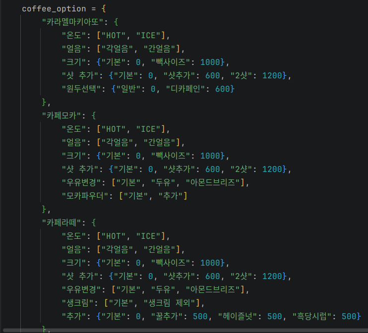 | 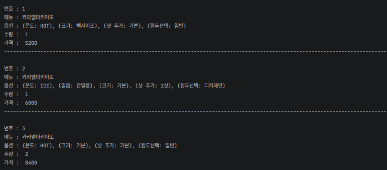 | 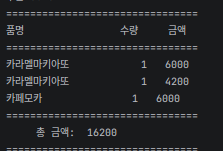 |

---

### 📝 코드 상세 보기 (Link)
* [옵션 선택 로직 코드](./RunScreen/옵션선택코드.png)
* [수량 변경 로직 코드](./RunScreen/수량변경코드.png)
* [영수증 가격 출력 코드](./RunScreen/영수증가격출력코드.png)
---

## 5. 프로젝트 회고

### 🔴 어려웠던 점 및 해결 과정
* **데이터 동기화 및 정밀 연산:** 장바구니 내 메뉴 갯수 변경 시 실시간 금액 일치 로직을 구현하기 위해 리스트 데이터를 인덱스 단위로 추적하고 수량이 0일 때 동기화하며 삭제하는 시스템을 완성했습니다.
* **영수증 출력의 시각화:** 한글과 숫자의 바이트 차이로 인한 정렬 문제를 파이썬 문자열 포맷팅 기능을 통해 데이터 타입별 공백을 계산하여 해결했습니다.

### 🟢 느낀 점 및 배운 점
* **협업의 핵심은 '활발한 소통':** 설계부터 마무리까지 팀원들과 소통하며 문제점을 조기에 발견하고 해결하는 과정의 중요성을 깨달았습니다.
* **로직 설계 역량의 강화:** 복잡한 데이터 처리 프로세스를 직접 해결하며 효율적인 알고리즘 설계와 예외 처리의 중요성을 체감했습니다.
